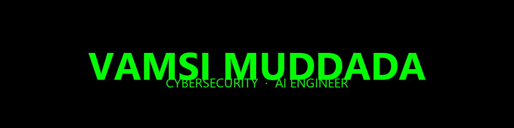

  

 

**VAMSI MUDDADA** — Cybersecurity & AI Engineer  
Building autonomous threat-intelligence systems that adapt in real time.

 

| **Domain** | **Core Technologies** | **Focus** |
|---|---|---|
| AI | LLMs, Graph Neural Networks, Transformers | Autonomous adversary emulation |
| Cybersecurity | MITRE ATT&CK®, SOAR, Threat Modeling | Adaptive defense & orchestration |
| Engineering | Python, PyTorch, LangChain, Streamlit | Full-stack ML architecture |
| Infrastructure | Git, Docker, REST APIs, Cloud Deployments | Enterprise CI/CD & scaling |

 

**[NEXUS – Autonomous Cyber-Warfare Simulator](https://github.com/vamsimuddada/NEXUS)**  
An enterprise-grade breach-and-attack-simulation platform driven by a LLM reasoning engine and countered by a Tri-Brain GNN defense matrix.

🔗 **Live demo:** [nexus-vamsimuddada.streamlit.app](https://nexus-vamsimuddada.streamlit.app/)

 

  
  &nbsp;
  

 

  
  &nbsp;
  
  &nbsp;
  

